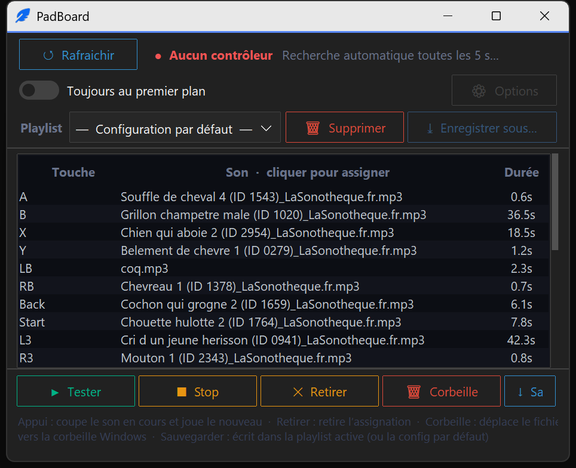

# 🎮 PadBoard — *Sound of da Pad*

**Turn any gamepad into a soundboard.** Map a sound to every button, D-pad direction, trigger and stick flick of your controller — then play them live.



## Features

- **Full controller mapping** — face buttons, bumpers, triggers, sticks (press *and* directions), D-pad: every input can fire its own sound.
- **Playlists** — save complete button↔sound mappings as named playlists and switch between them in one click (party pack, animal sounds, meme board…).
- **Folder import** — point it at a folder of sounds (subfolders included) and fill the pad automatically.
- **Silence trimming** — optional automatic removal of leading silence so sounds fire instantly (requires `numpy`).
- **Hot-plug** — controllers are rescanned every few seconds; connect or swap pads while the app runs.
- **Anti stick-drift** — held inputs auto-release after a timeout, so a drifting joycon won't loop a sound forever.
- **Dark themed UI** with window-state persistence.

## Installation

Requires **Windows** and **Python 3.10+**.

```bash
git clone https://github.com/hypedigger/PadBoard.git
cd PadBoard
pip install -r requirements.txt
python main.py
```

Optional — Start Menu shortcut:

```powershell
powershell -ExecutionPolicy Bypass -File install_shortcut.ps1
```

## Usage

1. Plug in a controller (Xbox, DualShock/DualSense, Switch Pro, most generic pads).
2. Click an input in the grid, pick a sound file (MP3/WAV/OGG) — or import a whole folder.
3. Press the button on your pad. That's it.
4. Save the mapping as a playlist to switch sound sets instantly.

Mappings, playlists and window state are stored locally next to the app (`controller_sounds_config.json`, `playlists/`) and are not part of the repository.

Need free sounds? [Pixabay](https://pixabay.com/sound-effects/) and [LaSonothèque](https://lasonotheque.org/) are great starting points (check each site's license for redistribution).

## Notes

- UI is currently in French; contributions welcome.

## Support

If PadBoard made your streams or game nights more fun:

[](https://ko-fi.com/hypedigger)

## License

[MIT](LICENSE)
